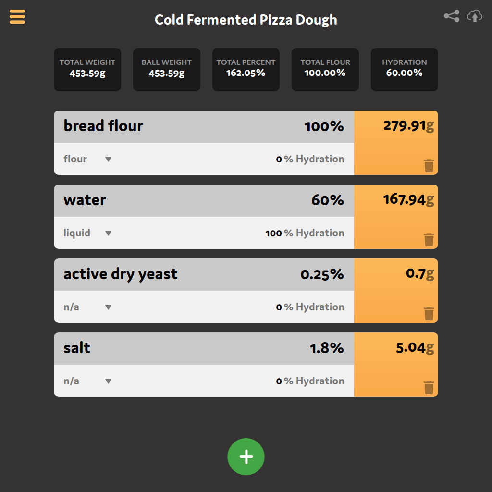

# BakersCalc

This is the frontend app for BakersCalc.

**Note:** This project can be run without an api, although saving and restoring functionality will not work.

Use `npm i` to install the dependencies and `npm start` to run the app. It should now be available on [localhost:3000](localhost:3000)!

## Quick Start

- To add ingredients click the green "+" button on the bottom
- To remove an ingredient click on its trash can icon
- Each ingredient have `name`, `percent`, `type`, and `hydration` properties

### Ingredients

- `flour` type ingredients are used to calculate the total flour
- `liquid` type ingredients are used to calculate the hydration
- `starter` type ingredients are handled uniquely - 100% hydration starter means it's been fed equal parts flour/water.

### Options

- When set to `thickness factor` mode, all pan size measurements should be supplied in inches